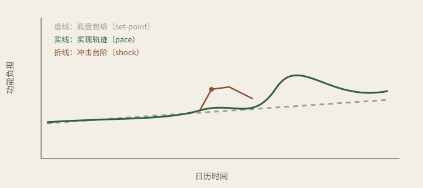
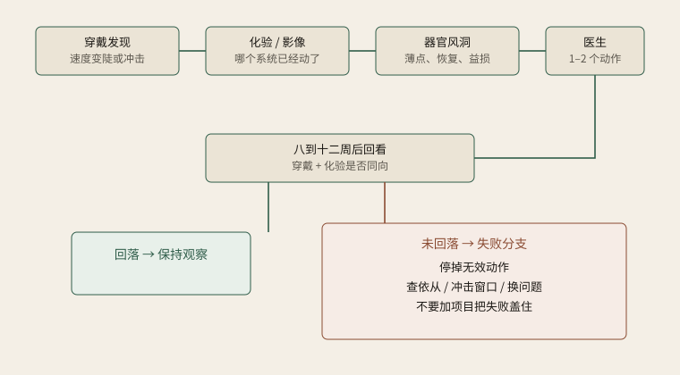

# 一张总图

<span class="part-kicker">跑多快 · 哪里薄 · 哪一步值得改</span>

先把全书的几何放在一页上。后面各章是在给这张图加刻度、加误差、加失败分支。图不是装饰，是阅读契约：后面凡说底盘、速度、台阶，凡说闭环和失败，都应当能在这两张图上指出对应的线段或方块。指不出来的句子，优先当成还没写清楚，而不是当成更高级的理论。

## 图 1：三条过程叠在同一条生命上

<div class="figure">

<p class="figure-caption">图 1　横轴是日历时间。虚线是底盘包络，实线是实现轨迹，折线是冲击台阶。点是年检，速度是实线的斜率，台阶是折线。</p>
</div>

请按这个顺序读，不要先找“我在哪一岁”。

横轴必须是日历时间。只有日期能让感染、手术、孕期、换表、改药落在同一根尺上。若把横轴换成生物学年龄，台阶会被抹成“这段时间老得快”，管理对象——台阶何时出现、有没有回去——会丢掉。纵轴是功能负担，不是寿命年份，也不是可以打印到小数点的身份。位置越高，系统越吃力。年检拿到的是这个平面上的一个点。管理要问的是点怎样连成线。

虚线是底盘包络（set-point，本书特指衰老基线形状）。它改得慢，像一条带子而不是钢丝：基因组和发育给出中心位置，带子的厚度来自后来还能不能被改写。化疗、病毒性心肌炎、慢性肾病可以把整条包络向下平移，那不是速度层的“这一年跑得快”，而是库存被削掉。读虚线时问约束，不问判决。

实线是实现轨迹。它贴着包络走，但不必重合。睡眠被切碎、内脏脂肪上去，斜率变陡；负担降下来，斜率可以变平。斜率就是速度（pace），而且只是生物标志与功能指标意义上的速度。用某一点的高度去审八周干预有没有把整段包络搬回二十岁，是拿位置贴纸去审速度计。

折线是冲击台阶。一次事件把实线抬高一截。有的折线随后落回原包络；有的落不回去，变成新地面。折线的管理对象是回落，不是把这一跳折算成“今年多老了几个月”。同一高度的折线含义可以完全不同：孕期上跳首先是生理重配置，心脏事件上跳更接近病理冲击。读图时若分不清这两种折线，后面的回落时钟会用错。

图上没有画误差带。这不是因为没有误差，而是因为误差属于测量学那一章的刻度：肤色、运动伪迹、换表、未分层的周期，都可以让实线和折线假阳性。没有误差带的图 1，看起来像命运已经画好，或者像橡皮已经买到。有了误差带，图 1 才是可以争的对象。

常见的三种读图错误，可以对照着排掉。第一种，把人群寿命表当成个人功能曲线。寿命表说的是一群人活到各年龄的比例；图 1 说的是同一个人的负担如何随日期变化。第二种，把虚线读成“基因判决”，把实线读成“意志”，把折线读成“运气”。三层都有生物学，也都有可操作的窗口，只是窗口长度不同。第三种，把图 1 上某一点的高度印成“您的身体正以某岁运行”。点是年检，斜率是速度，折线是台阶。第一章把这三句话钉死；这里只要求：读图时手里要有日期，而不是手里有一个年龄商品。

## 两把尺子不要画在同一根轴上

图 1 全部属于已经走出来的路：穿戴、血液时钟、临床化验和影像，都可以在日历轴上留下点或斜率。细胞副本是另一根轴。

```
尺子 A　穿戴 / 血液时钟 / 临床
        问：已经走出来的速度和台阶

尺子 B　个人细胞副本（以及未被完全重置的原代细胞）
        问：擦不掉的脆弱，以及再放回老年环境后会怎样垮
```

把 A 上的坏消息和 B 上“看起来年轻的细胞照片”贴在同一页，是非法报告。合法报告在第六章末：日龄、成熟标志、队列人数、批次、阳性对照，写进结论的前提，而不是写进喜报。图 1 解释不了为什么培养皿里的细胞看起来像十九岁——那是重编程的方法学特征，常常还带着发育不成熟。总图把两把尺子分开画，是为了让后面的风洞章不必再发明一种新的年龄。

并列还有第三把更土的尺子：化验和影像。它问的不是“将要怎样垮”，也不是“这一周斜率”，而是“哪个系统已经在分子或结构上动了”。三把尺子对得上，窗口才硬；一对上、另外两把沉默，优先当成测量学事件。前言把分工说过一次，第二十二章会再收一次。总图只保留几何：不要把三把尺子焊成一个“逆龄分数”。

## 图 2：闭环必须能失败

<div class="figure">

<p class="figure-caption">图 2　可检验闭环。未回落不是加项目的理由，而是停、查依从、换问题的理由。</p>
</div>

上排从左到右是主路径：穿戴发现速度变陡或冲击未回落 → 化验或影像确认哪个系统已经动了 → 器官风洞解释薄点、恢复力和益损 → 医生选出一到两个动作。下排中间的方块是回看：八到十二周，用同一把穿戴尺子和化验看方向是否同向。

绿色分支：回落，保持观察。不要把回落写成已经延寿，也不要立刻加项“巩固疗效”。回落只说明这次冲击或这次动作没有把路抬到新地面。

褐色分支：未回落。这是图 2 真正要保护的东西。失败被画进主图，而不是写在段末当礼貌。未回落之后的三步是停掉无效动作、查依从和冲击窗口、换一个问题。禁止的步骤是加项目把失败盖住。一个不能失败的流程图，一定在卖希望。

读图 2 时请同时记住两句限制。第一句：选一到两个动作，是为了对抗把礼包当管理；多病共存时无法永远只动两下，第十八章会承认这一点，总图不把“两下”画成教条。第二句：芯片异常而真实世界斜率完全平稳，正确分支是重复和谨慎，不是沿上排一路升级到注射。林某那份十二周档案是图 2 的可检验实例：哪些回落、哪些没有、哪些被拦住，都应当能在这张图上找到方块。

风洞方块还有一个容易被看漏的出口：有害档。预演若给出毒性信号，主路径在医生动作之前就应折向“拦住”，而不是折向“观察一下”。拦住是健康贡献，不是平台没卖成产品的失败。图 2 把风洞放在化验之后、医生之前，就是为了让这个出口存在。把风洞拖到医生签名之后，出口会变成售后。

## 章节怎样落到图上

不必把全书背下来。读每一部之前，先在图上指出将要被展开的那一段。

| 你读的部分 | 图 1 上对应 | 图 2 上对应 |
|---|---|---|
| 第一部 | 虚线、实线、折线的定义 | 还不进入闭环，只承认对象存在 |
| 测量学 | 误差带（图上未画出，必须自行补上） | 每个箭头的校准：换表、批次、最小 N |
| 第三部 | 实线的斜率和折线的回落 | 最左的“发现”和底部的回看 |
| 第二、四部 | 不在图 1 的日历轴上 | 风洞方块：薄点、恢复、益损、拦住 |
| 第五部 | 一次动作之后实线有没有变平、折线有没有落下 | 整张图，尤其是褐色失败分支 |
| 第六部 | 图 1 解释不了的支柱（微生物、孤独、暴露） | 图 2 画不出的数据权利：细胞数据不得默训对外模型 |

这张对照表的用处是防跳步。有人读完第四部，会以为虚线已经被芯片改写了；对照表说：芯片不在图 1 的日历轴上，它只给图 2 的解释方块供货。有人只看第三部，会以为实线变平就是管理完成；对照表说：还没有风洞，也还没有失败分支。有人直接买种子，会以为已经走完图 2；对照表说：种子甚至不在这两张图的主路径上，它是终末期权，第十七章才展开。

图 2 还有一个时间刻度，容易被流程图的无时间感骗过去。发现可以是几天内的趋势，化验常常是一周内的血，风洞如果真做，制备和分化是周到月的尺度，回看是八到十二周。把四个方块画成同一天发生的流水线，会把稀缺能力画成已经上线的产品。总图必须在这里诚实：上排是逻辑顺序，不是预约日历。个人多器官风洞作为常规医疗仍然稀缺；群体层的连续生理和血液时钟已经存在。可管理，首先是这张图在逻辑上闭得上，其次才是某个人的某一年里方块是否齐。

印刷时请看 SVG 里的中文标签。若标签缺字，以本章图注为准：图 1 三条线的名字是底盘包络、实现轨迹、冲击台阶；图 2 褐色方块的名字是失败分支。读纸书时，失败分支比上排箭头更值得用笔圈出来。圈不出来，书就还是一份被切碎的提纲。

## 一张总图不代替任何一章

总图有意写短于后面的专章。它负责位置，不负责证据。PpgAge 的队列、CALERIE 的减速、四天芯片的表型，都不应当出现在总图里冒充已经画进线条的事实。线条只说：有底盘、有速度、有台阶；有发现、有解释、有动作、有回看、有失败。证据在第十章和附录。操作在第十一、十六、十八章。一个人身上转不转得动，在病例章。

也因此，总图拒绝第三种装饰用法：把图 2 做成机构介绍里的“我们的闭环”。没有误差模型的缺口、没有参考队列的尾部、没有成熟标志的动作电位、没有重叠校准的换表，都不能进入图 2 的决策方块。测量学把这条写成禁令。总图只把它画成：箭头不是自动的。人还在方块之间，医生还在动作之前，失败还在回看之后。

## 图上故意没画的东西

总图会骗人的另一种方式，是让读者以为没画出来的就不存在。图 1 没有把免疫和肌肉画成单独的线，不等于薄点只有心、肝、神经。感染后的失代偿、肌少、疫苗反应差，是真实世界更高频的折点，第十四章必须补上。图 1 也没有画月经周期：卵泡期和黄体期的包络本来就不是同一条带子，第十一章才分层。图 2 没有画多病共存时动作超过两件的情形，不等于临床上永远只动两下。

源文件路径从 `src/` 算起，是 `figures/curve.svg` 与 `figures/loop.svg`。图 1 的几何大约是：虚线从左上缓慢向右下倾斜，像一条松的包络；实线贴着它扭动，中段有一次抬升；褐色折线在抬升处形成台阶，顶点常有一个圆点，表示事件可见峰。图 2 的几何大约是：上排四个方块从发现走到动作，中排回看，底部一侧回落、一侧失败。中文标签若显示成乱码或方框，以本章图注为准；标签修复交给统稿，不改变上述几何。读图时请用手指点线，而不是用眼睛找岁数。

没画，是因为一张图只能承担一组几何。补进所有器官、所有性别生理、所有共病，图会重新变成无法阅读的宣传海报。正确用法是：看见空白，就去对应章节，而不是把空白读成“已经覆盖”。微生物组、孤独、暴露组连空白都没有资格出现在图 2 里——它们是图外的支柱，第二十一章给最小外接，不给假装。

图 2 必须能走回去。回看之后无论回落还是失败，箭头都应指回发现：下一次斜率或下一次冲击，仍从手腕开始。画成单向流水线，闭环就死成了开环的更贵版本。失败分支指回发现时，问题应当已经被改写——依从、窗口、薄点、传感器——而不是原问题加一项商品。林某第八周“不升级”就是这种指回：窗口还开着，发现继续，不加项。

第三把尺子不画在 SVG 里，却决定图 2 的第四个方块是不是空的：医生问哪一步值得改。读图 1 时用尺子 A 看已经走出来的路，不要把尺子 B 的年轻照片贴上去做减法。读图 2 时看失败分支有没有被画进主图；没画，这张图就还是开环展览。两张图合在一页上，只为了让后面各章有一个可以指认的位置，不是为了把全书倒进图注。图在，说明才算数。

先读图 1，确认后文说的改写改的是虚线、实线还是折线。再读图 2，确认每一个承诺有没有回看和失败分支。然后进入测量学：图上每一个箭头都带着误差。缺口跳动可能来自肤色、运动伪迹和换表；风洞的“尾部”没有足够大的参考队列就不能声称。没有误差，两张图会重新变成营销流程图。

跳读时也可以把图当索引。只关心穿戴：图 1 的实线和折线，加上图 2 的发现与回看。要审一家细胞公司：图 1 不要用来解释培养皿照片，图 2 的风洞方块必须能输出拦住。想检验本书是否可操作：带着图 2 去读「一个人的十二周」，看失败分支有没有真的被用上。林某第十二周：黄体期 HRV 回落到包络下沿，对应绿色分支；活动量未回到中位，对应褐色分支里的“不要加项”；年轻血浆被挡，对应风洞方块的有害档出口。三件事都能在图上指出，这一章才算把全书钉在几何上，而不是钉在形容词上。

> [!WARNING]
> 易误读：把图 1 当成寿命合同，或把图 2 当成已经能在市场上买到的完整管理。连续生理和血液时钟在群体层已经存在；个人多器官风洞作为常规医疗仍是稀缺能力。图是尺子的位置，不是已经交付的服务。把图 2 印进机构手册却不画褐色方块，等于把这本书最硬的一笔擦掉。读下去之前，请先确认你能在纸上指出：虚线、实线、折线、失败分支。指得出，总图才算读完。

网页和印刷看到的应是同一张几何。若印刷页底部冒出 Keyboard shortcuts，请当网站控件，不是正文；打印样式会把它藏掉。SVG 里的中文若在某台机器上缺字，以图注为准，不要用缺字的图去讲课。总图读完，下一章是测量学：没有误差，这两张图会重新变成流程海报。测量学读完，才进入第一部把三条线写成可以操作的对象。

手绘也够用。图 1：横轴写日期，画一条浅的虚带子当底盘，一条贴着走的实线当速度，中间抬起再落下或落下不回去的折线当冲击。图 2：四个方块横排——发现、化验、风洞、医生——下面一个回看，回看分出回落和未回落。未回落写出停、查、换问题。画完请检查：有没有日期，有没有失败，有没有把细胞照片贴在日历轴上。三项里缺一项，手绘图和网站海报就还是同一类东西。

能画出来，这本书才从原则变成可以争的对象。争的是哪一条线、哪一个方块，而不是哪个形容词更激动人心。

三问也可以标在图上。跑多快，标在实线的斜率。哪里薄，标在虚线带子上最容易被折线顶穿的位置，以及图 2 风洞方块的输出。哪一步值得改，标在医生方块和失败分支之间：值得改的动作必须能在八到十二周后被回看。三问落不到图上，就还不是这本书的问题，只是购物清单上的问题。把三问写在部首或页眉上，替代段内反复，正是为了让图和问共用一套坐标。

第一部开始之前，请带着这两张图走。后面各章都是在给线段加刻度，而不是再发明一套几何。刻度会包括：双生子相关是中等的、孕期上跳是生理重配置、四天芯片只是部分表型、穿戴深睡不是慢波、没有队列不能称尾部。这些句子不画进 SVG，但读图时必须当作看不见的刻度。看不见的刻度比看得见的曲线，更决定这张总图是不是还能被辩护。把这些刻度读成扫兴，会重新去买橡皮；把它们读成坐标，曲线才从命运变成对象。对象出现之后，第一部才有东西可拆。
